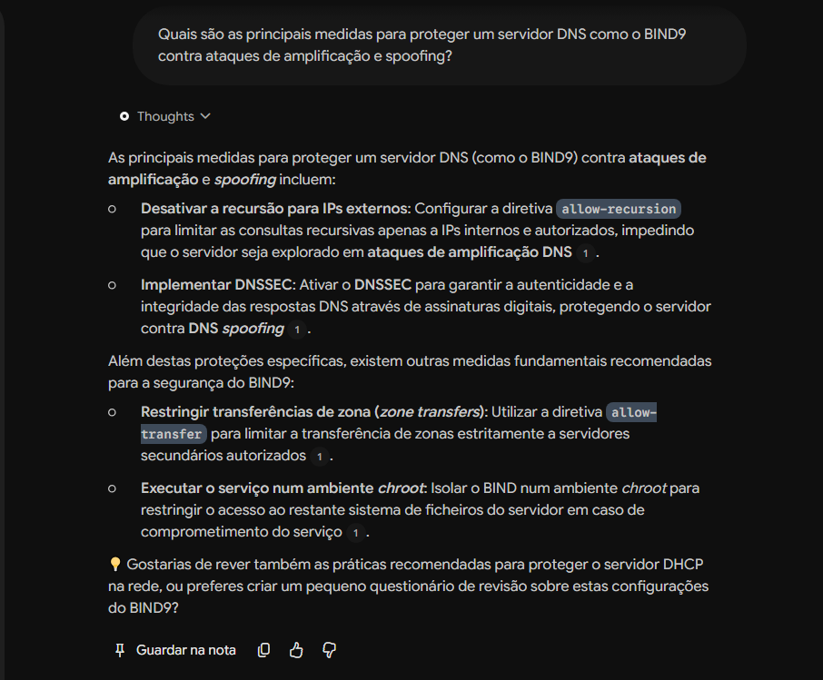

# Segundo Cérebro: Especialista em Segurança de Active Directory e Redes

## 🎯 Tema e Objetivo
Quero montar no Gemini Notebook um segundo cérebro sobre Segurança em Active Directory e Infraestrutura de Redes (DNS/DHCP), focado em mitigar as principais vulnerabilidades. O objetivo é criar um assistente de estudo e consulta rápida para melhores práticas de cibersegurança em administração de sistemas.

## 📚 Fontes Escolhidas
1. **Microsoft - Securing Active Directory:** Documentação técnica oficial e documentação de "Best Practices" da própria fabricante (Microsoft), sendo a fonte mais fiável para arquitetura de segurança em Windows Server.
2. **Guia de Segurança DNS e DHCP:** Apontamentos técnicos focados em mitigações práticas, incluindo configurações para BIND9 e proteção contra rogue DHCP. Confio nestas fontes porque refletem os standards da indústria.

## 🤖 Diretriz de Comportamento (Prompt)
"Aja como um Engenheiro de Cibersegurança Sénior focado em infraestrutura. Responda de forma técnica, direta e estruturada, utilizando exclusivamente as informações presentes nas fontes carregadas. Justifique sempre as mitigações sugeridas."

## 💬 Interação e Citações

**Pergunta feita ao Notebook:**
"Quais são as principais medidas para proteger um servidor DNS como o BIND9 contra ataques de amplificação e spoofing?"

**Resposta do Notebook (baseada nas fontes):**
Para proteger o BIND9, as principais medidas são:
1. Restringir as transferências de zona apenas a servidores secundários autorizados com a diretiva `allow-transfer`.
2. Desativar a recursão para IPs externos (`allow-recursion`) para evitar ataques de amplificação DNS.
3. Implementar DNSSEC para garantir a autenticidade e integridade das respostas, protegendo contra DNS spoofing.
4. Executar o serviço num ambiente isolado (chroot) para limitar o acesso ao sistema operativo em caso de comprometimento.

*(Citação confirmada através da fonte: Guia de Segurança DNS e DHCP)*

### 📸 Evidência da Citação
*(O ficheiro do print que fizeste upload deve ter o nome exato que está abaixo para aparecer aqui)*

## 🔗 Link do Notebook
[Acede aqui ao meu Gemini Notebook Público](https://gemini.google.com/notebook/620df2bc-efd4-4d4c-8af2-4ffaa8b3dc1e)
